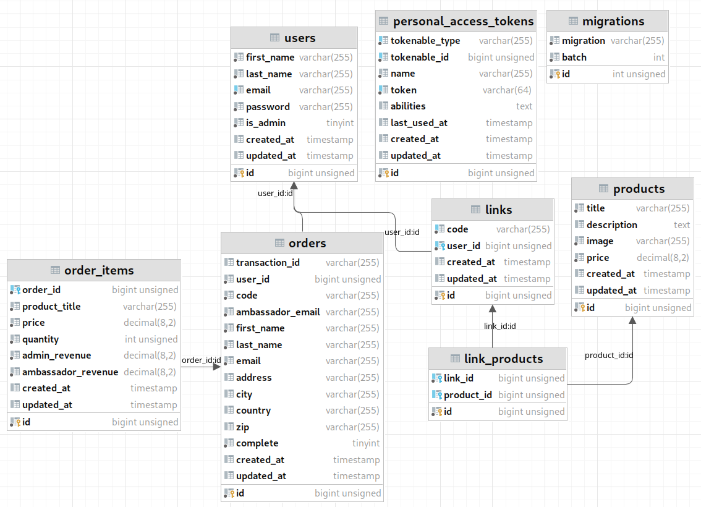
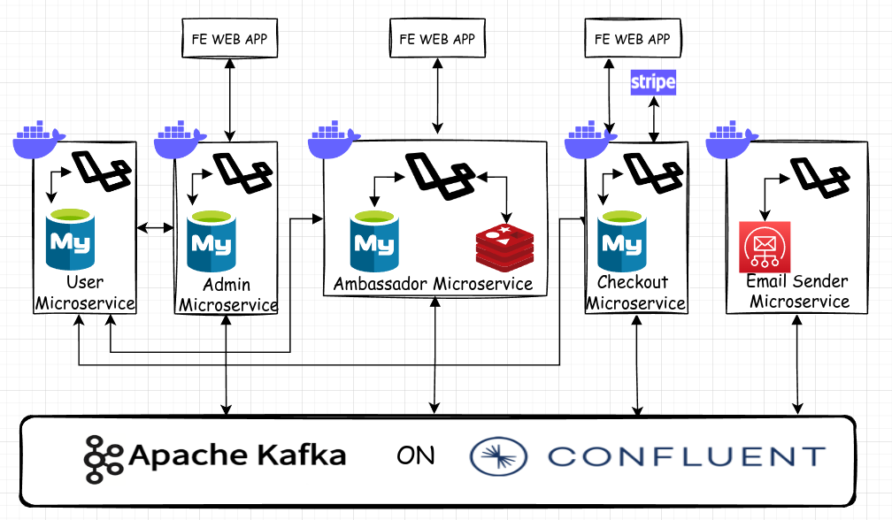

# A Brief description of the application:

&nbsp;&nbsp;&nbsp;This application is a retail application with two kinds of users admin and ambassador.  Admin is responsible for executing CRUD operation on the product. Ambassador similar to a reseller, its job is to sell the product to buyers. Ambassadors can choose what product they want to resell and create a payment gateway link for the product they choose to resell. Then,  the buyers can click the link that was created by the ambassador to buy and pay for the product. If the payment went successful, the ambassador gets 10% of revenue from the total payment and the admin gets 90% revenue. For every successful transaction admin and ambassador, an email will be sent to the admin and ambassador informing the revenue they got.
 

# The monolith application's ERD
  
extra note (implicit relation):
<ul>
    <li><code>links</code> is belongs to <code>orders</code></li>
    <li><code>products</code> is belongs to <code>order_items</code></li>
</ul> 

# The microservices architecture

 

# Function of each microservices
<li>User Microservices:
    <ul>
        <li>Holds the user data (ambassador and admin) on the database</li>
        <li>Performing CURD operations on user data (ambassador and admin)</li>
        <li>Providing users data for other microservice</li>
        <li>User authentication</li>
    </ul>
</li>
<li>Admin Microservice
    <ul>
        <li>Servicing admin panel frontend web app</li>
        <li>Admin user authorization</li>
        <li>Performs CRUD operation on products by invoking checkout microservice</li>
        <li>Showing orders history</li>
    </ul>
</li>
<li>Email microservice
    <ul>
        <li>Servicing ambassador's frontend web app</li>
        <li>Listing the available products to the ambassador</li>
        <li>Enables the ambassador to select a group of products they want to resell</li>
        <li>Creates chekout/payment link for a group of product choosen by the ambassador by invoking checkout microservice</li>        
    </ul>
</li>
<li>Checkout/Product microservice
    <ul>
        <li>Holds all data related to products and transactions and provides it to other micreoservices</li>
        <li>Defining the relation between products, ambassador, and links created by the ambassador</li>
        <li>Invokes and sends transaction detail to the email microservices if a transaction went successfuly</li>
        <li>Invokes and sends transaction detail to the email microservices if the transaction went successfully</li>        
    </ul>
</li>
<li>Checkout/Product microservice
    <ul>
        <li>Connects to the SMTP server</li>      
        <li>Listening incomming message from checkout microservice</li>
        <li>Sending notification email about a successful transaction to the admin and the ambassador that owns the link</li>
    </ul>
</li>
 

